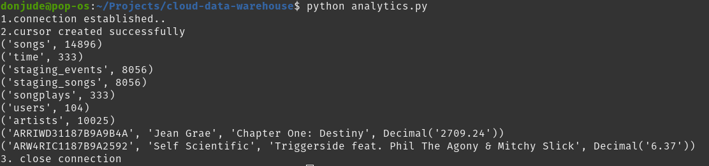

# Cloud Data Warehouse with Amazon Redshift

## Project Summary

Sparkify is a music straming startup that has grown their user base and song database and would want to move their processes and data onto the cloud. Their data consist of user activities on using the music streaming up as well as metadata on the songs in their app. These data are currently stored on Amazon s3 storage bucket on Amazon Web Service.

Sparkify requires an ETL pipeline to be built that extracts their data from s3, stages the data in Redshift, and transforms the data into a set of dimensional tables for their analytics team to continue finding insights in what songs their users are listening to. The database and ETL pipeline would be tested by running queries given by Sparkify analytics team and compare results with their expected results.


## Project Description

In this Project an ETL pipeline would be built for a datawarehouse hosted on Amazon Redshift using Amazon Webservice(AWS) cloud computing platform. The ETL pipleine would load data from s3 to staging tables on Redshift and execute SQL statements that create the analytics tables from these staging tables.


## Datasets

There are two datasets:

- **Song datasets**: Each file is in JSON format and contains metadata about a song and the artist of that song.

    **Location:** `s3://udacity-dend/song_data`
    
    **Sample:**
```JSON
{"num_songs": 1, "artist_id": "ARJIE2Y1187B994AB7", "artist_latitude": null, "artist_longitude": null, "artist_location": "", "artist_name": "Line Renaud", "song_id": "SOUPIRU12A6D4FA1E1", "title": "Der Kleine Dompfaff", "duration": 152.92036, "year": 0}
```


- **Log datasets**: The second dataset consists of log files in JSON format generated by this event simulator based on the songs in the dataset above. These simulate activity logs from a music streaming app are based on specified configurations.

    **Location:** `s3://udacity-dend/log_data` <br/>
    **log data JSON path:** `s3://udacity-dend/log_json_path.json`
    
    **Sample:**
    
    ```JSON
{"artist":null, "auth":"Logged In", "firstName":"Walter", "gender":"M", "itemInSession":0, "lastName":"Frye", "length":null, "level":"free", "location":"San Francisco-Oakland-Hayward, CA", "method":"GET", "page":"Home", "registration":1540919166796.0, "sessionId":38,"song":null, "status":200, "ts":1541105830796, "userAgent":"\"Mozilla\/5.0 (Macintosh; Intel Mac OS X 10_9_4) AppleWebKit\/537.36 (KHTML, like Gecko) Chrome\/36.0.1985.143 Safari\/537.36\"", "userId":"39"}
```

## Database Schema
The database Schema consists of two staging tables to load the two datasets from Amazon s3 bucket into the data warehouse. There is also a star schema model (the analytics database) which consists of one fact table that contains all the measurable and quantitative data about each song. It refrences 4 different dimension tables that describes the attributes related to the fact table.

The database schema as described above has been built this way because the etl pipeline process requires a staging area where data can be cleaned, transformed and merged before inserting into the analytics database where sparkify analytics team can execute their queries.

### Staging Events & Songs tables
The below two datas are the staging tables from which the files are loaded into before data transformation takes place.

```SQL
CREATE TABLE IF NOT EXISTS staging_events
(
    artist             VARCHAR
    ,auth              VARCHAR
    ,firstName         VARCHAR
    ,gender            VARCHAR
    ,itemInSession     INTEGER
    ,lastName          VARCHAR
    ,length            FLOAT
    ,level             VARCHAR
    ,location          VARCHAR
    ,method            VARCHAR
    ,page              VARCHAR
    ,registration      FLOAT
    ,sessionId         INTEGER
    ,song              VARCHAR
    ,status            INTEGER
    ,ts                TIMESTAMP
    ,userAgent         VARCHAR
    ,userId            INTEGER 
);


CREATE TABLE IF NOT EXISTS staging_songs
(
    num_songs          INTEGER
    ,artist_id         VARCHAR
    ,artist_latitude   FLOAT
    ,artist_longitude  FLOAT
    ,artist_location   VARCHAR
    ,artist_name       VARCHAR
    ,song_id           VARCHAR
    ,title             VARCHAR
    ,duration          FLOAT
    ,year              INTEGER
);
```

### Fact Table
This contains the measurable and quantitative data about each song. Below is the single fact table and its SQL code.


**songplays** - records in log data associated with song plays.


```SQL
CREATE TABLE IF NOT EXISTS songplays
(
    songplay_id        INTEGER      IDENTITY(0,1)
    ,start_time        TIMESTAMP    NOT NULL
    ,user_id           INTEGER      NOT NULL
    ,level             VARCHAR(20)
    ,song_id           VARCHAR(800) NOT NULL
    ,artist_id         VARCHAR(800) NOT NULL
    ,session_id        INTEGER      NOT NULL
    ,location          VARCHAR(800)
    ,user_agent        VARCHAR(800)
    ,PRIMARY KEY(songplay_id)
    ,FOREIGN KEY(start_time) REFERENCES time(start_time)
    ,FOREIGN KEY(user_id) REFERENCES users(user_id)
    ,FOREIGN KEY(song_id) REFERENCES songs(song_id)
    ,FOREIGN KEY(artist_id) REFERENCES artists(artist_id)
)
DISTKEY(start_time)
SORTKEY(start_time);
```

### Dimension Tables
These tables references the fact table and contains descriptive attributes related to the fact table. Below are all the 4 tables and their sql codes.

**users** - users in the app

```SQL
CREATE TABLE IF NOT EXISTS users
(
    user_id            INTEGER      NOT NULL
    ,first_name        VARCHAR(256) NOT NULL 
    ,last_name         VARCHAR(256) NOT NULL
    ,gender            VARCHAR(256)
    ,level             VARCHAR(20)
    ,PRIMARY KEY(user_id)
)
SORTKEY(user_id);
```

**songs** - songs in music database

```SQL
CREATE TABLE IF NOT EXISTS songs
(
    song_id            VARCHAR(256)
    ,title             VARCHAR(800) NOT NULL
    ,artist_id         VARCHAR(800) NOT NULL
    ,year              INTEGER
    ,duration          FLOAT        NOT NULL
    ,PRIMARY KEY(song_id)
)
SORTKEY(song_id);
```

**artists** - artists in music database

```SQL
CREATE TABLE IF NOT EXISTS artists
(
    artist_id          VARCHAR(800) NOT NULL
    ,name              VARCHAR(800) NOT NULL
    ,location          VARCHAR(800)
    ,lattitude         FLOAT 
    ,longitude         FLOAT
    ,PRIMARY KEY(artist_id)
)
SORTKEY(artist_id);
```

**time** - timestamps of records in songplays broken down into specific units

```SQL
CREATE TABLE IF NOT EXISTS time
(
    start_time         TIMESTAMP NOT NULL
    ,hour              INTEGER
    ,day               INTEGER
    ,week              INTEGER
    ,month             INTEGER
    ,year              INTEGER
    ,weekday           VARCHAR(100)
    ,PRIMARY KEY(start_time)
)
DISTKEY(start_time)
SORTKEY(start_time);
```


## Project Setup
The project setup consist of all the scripts require to reproduce this project.

- `analytics.py` - This script contains python functions that invokes the analytics queries from the `sql_queries.py` script and returns the results the terminal.


- `aws_sdk_create_redshift_cluster.ipynb` - This notebook contains the Infrastruction as code (IAC) script to create an Amazon Redshift database and set up the necessary policies and configurations to enable the project to be run from the Shell/Terminal.


- `sql_queries.py` - This script contains all the SQL queries for dropping existing tables, creating all the tables, inserting data into staging and analytics data tables and also running analytic queries.


- `create_table.py.py` - This script contains python functions that establishes connection with the data warehouse and executes the `sql_queries.py` script to perform the droping of existing tables and creating of all the tables.


- `etl.py` - This script implements the codes in the etl.ipynb notebook for a smooth extract transform and loading of the datasets into the database.

## Run Scripts

1. Install AWS Command Line Interface awscli from the Terminal/Bash Shell.

    On Linux:<br/>
    ```$ sudo apt install awscli```

    On Windows:<br/>
     ```C:\> msiexec.exe /i https://awscli.amazonaws.com/AWSCLIV2.msi```


2. Run pip to install AWS Python SDK(boto3), pandas and psycopg2-binary.

    ```$ pip install boto3 pandas psycopg2-binary```


3. Run the below on your local git bash/Terminal to clone the github repository.

    ```$ git clone https://github.com/donjude/cloud-data-warehouse.git```

4. Create an AWS account. Create a configuration file with name `dwh.cfg` in the same folder as the notebook `aws_sdk_create_redshift_cluster.ipynb`, and fill in the necessary details as seen below. You may read more about IAM User, Access Key and Secret Key in the following link: [Create IAM User.](https://docs.aws.amazon.com/IAM/latest/UserGuide/id_users_create.html#id_users_create_console)


```
[AWS]
KEY         =
SECRET      =

[CLUSTER]
HOST        =
DB_NAME     =
DB_USER     =
DB_PASSWORD =
DB_PORT     = 5439

[IAM_ROLE]
ARN         = 

[S3]
LOG_DATA       = 's3://udacity-dend/log_data'
LOG_JSONPATH   = 's3://udacity-dend/log_json_path.json'
SONG_DATA      = 's3://udacity-dend/song_data'


[DWH] 
DWH_CLUSTER_TYPE       = multi-node
DWH_NUM_NODES          = 4
DWH_NODE_TYPE          = dc2.large
DWH_IAM_ROLE_NAME      =
DWH_CLUSTER_IDENTIFIER =
DWH_DB                 =
DWH_DB_USER            =
DWH_DB_PASSWORD        =
DWH_PORT               = 5439
```

5. In the cloned repository on your local computer, open the jupyter notebook file `aws_sdk_create_redshift_cluster.ipynb`, follow the instruction and run the notebook cells to create a Redshift Database on AWS.

6. Run the python file `create_tables.py` in the terminal/shell to create the database staging and analytics tables.
    
    `$ python create_tables.py`

7. Run the python file `etl.py` to execute the etl process of extracting data from staging to the analytics tables.
    
    `$ python etl.py`

8. Run the `analytics.py` file to test the counts of records in each table and also query the tables to get results about which artist and songs has the highest and lowest streaming durations.

## Query Results

The results below shows all the tables in the data warehouse and their record counts after executing the analytics query.

The last two details shows shows the artist and their songs that has the highest and the lowest streaming durations respectively.




### References:
1. https://docs.aws.amazon.com/redshift/latest/dg/r_CREATE_TABLE_examples.html
2. https://docs.aws.amazon.com/IAM/latest/UserGuide/getting-set-up.html